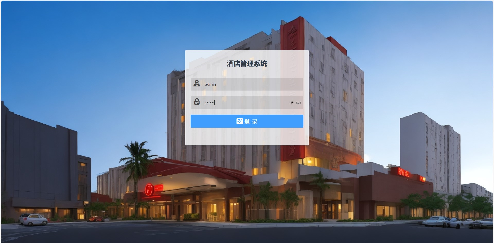
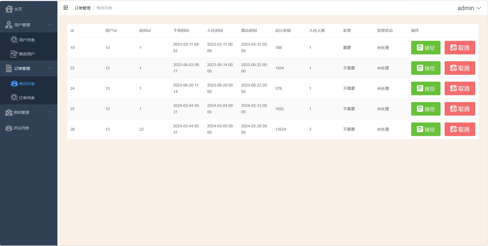
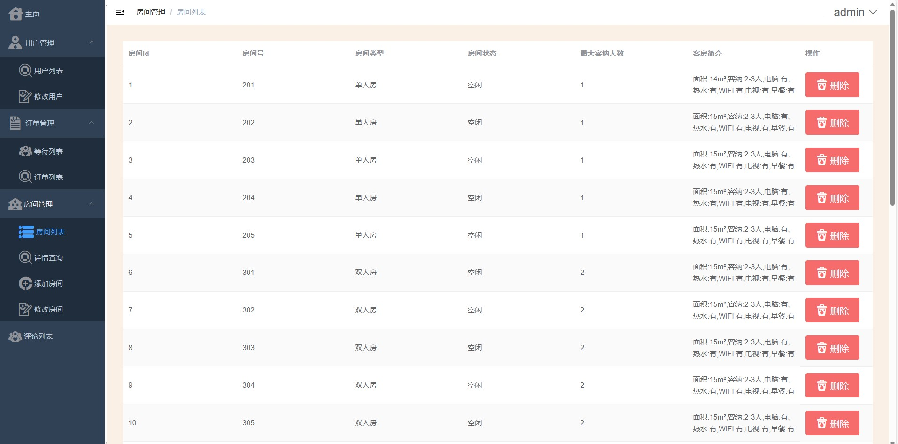
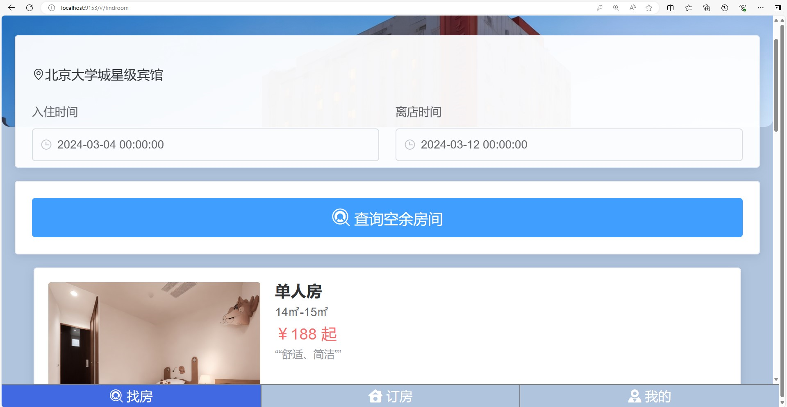
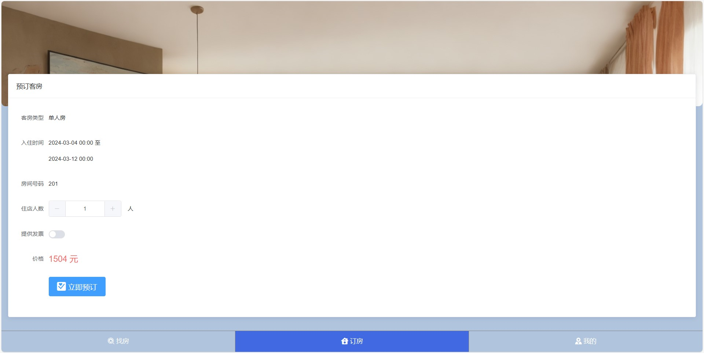
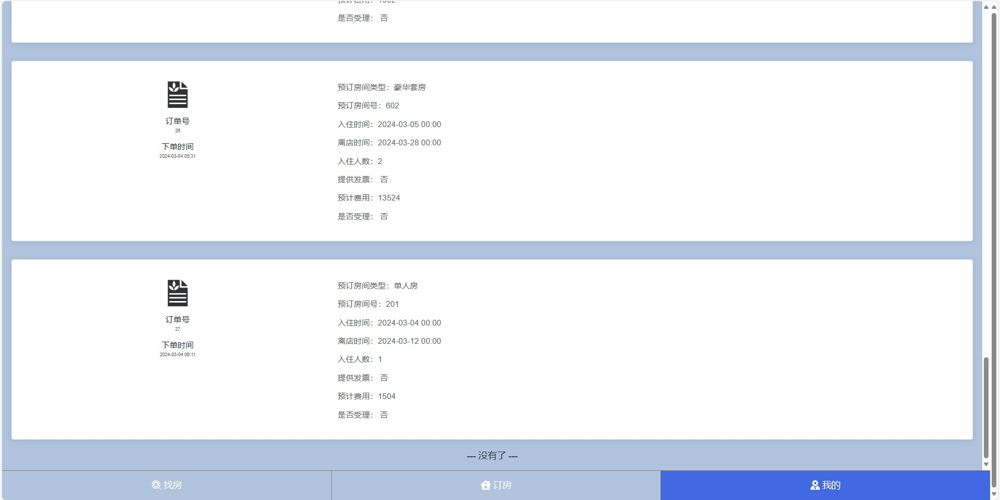
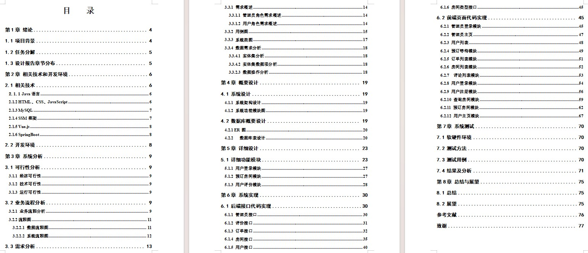
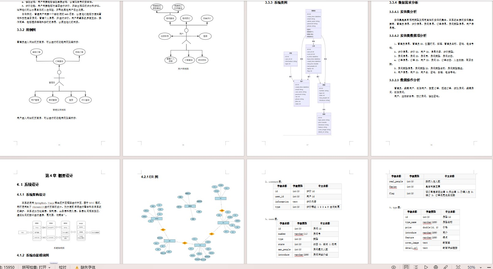

# 基于springboot+vue前后端分离的酒店管理系统

### 9.9￥ 获取完整源码+sql，附赠15000字论文参考，需要的加Q：3808981644 备用Q：3577148218
### 有问题，或者需要协助调试运行项目的也可联系

## 一、介绍

运行环境:idea或eclipse vscode 数据库:mysql

开发语言：java

前端技术：vue、element-ui

后端技术：springboot、mybatisplus

系统有两个角色：管理员和用户

管理员：登录、用户管理、订单管理（处理酒店预约订单、查看订单列表）、房间管理（房间列表、详情查询、添加房间、修改房间）、评论列表

用户：注册、登录、查询空余房间、房间预约、我的（查看预约订单）

## 二、部分页面截图展示

## 三、15000字论文参考

### 9.9￥ 获取完整源码+sql，附赠15000字论文参考，需要的加Q：3808981644 备用Q：3577148218
### 有问题，或者需要协助调试运行项目的也可联系

